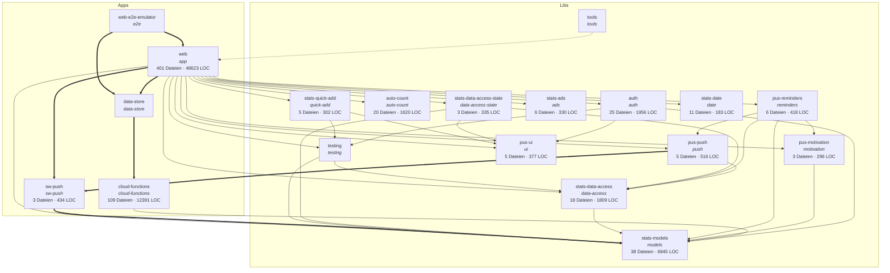
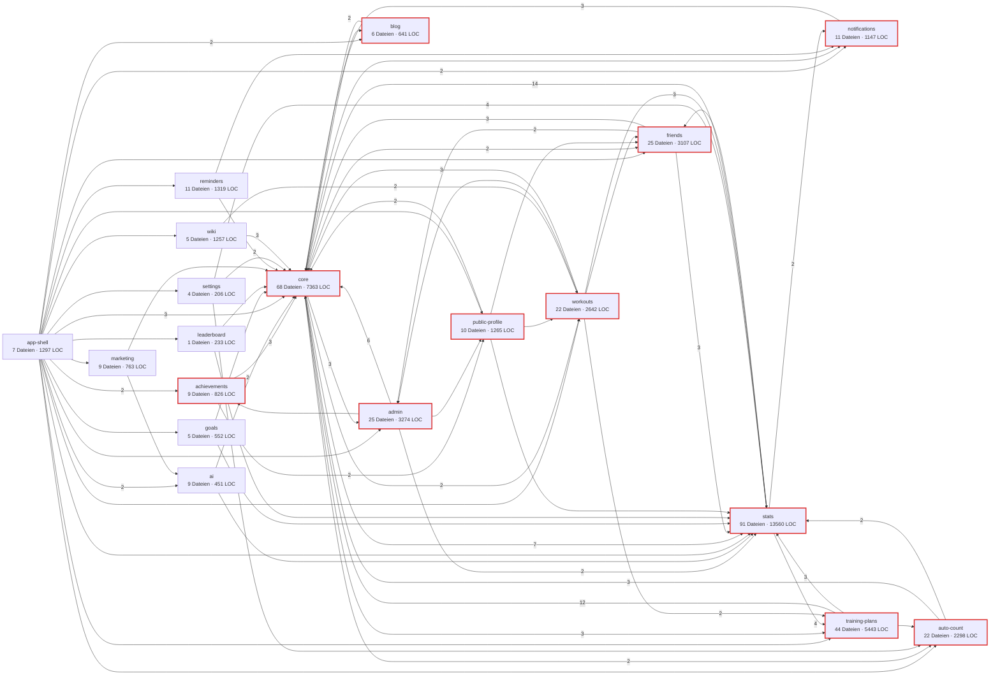

# Architektur-Diagramme

> **Generiert** von `pnpm nx run tools:generate-architecture-diagrams` — nicht von Hand
> bearbeiten. Die wöchentliche Routine [`architecture-review`](../../.claude/routines/architecture-review.md)
> aktualisiert diese Datei und `metrics.json`; Regeln und Hintergründe stehen in
> [`docs/architecture.md`](../architecture.md).

## 1. Nx-Projekte

Pfeile: `-->` statischer Import, `-.->` dynamischer Import, `==>` implizite Abhängigkeit.

### Kopplung der Projekte (statische Kanten)

| Modul                     | Dateien |   LOC | > 250 LOC | Ca (eingehend) | Ce (ausgehend) | Instabilität |
| ------------------------- | ------: | ----: | --------: | -------------: | -------------: | -----------: |
| `auth`                    |      25 |  1956 |         1 |              1 |              3 |         0.75 |
| `auto-count`              |      20 |  1620 |         0 |              1 |              0 |         0.00 |
| `cloud-functions`         |     109 | 12391 |         9 |              0 |              1 |         1.00 |
| `pus-motivation`          |       3 |   296 |         0 |              2 |              1 |         0.33 |
| `pus-push`                |       5 |   516 |         1 |              2 |              1 |         0.33 |
| `pus-reminders`           |       6 |   418 |         0 |              1 |              4 |         0.80 |
| `pus-ui`                  |       5 |   377 |         0 |              4 |              0 |         0.00 |
| `stats-ads`               |       6 |   330 |         0 |              1 |              0 |         0.00 |
| `stats-data-access`       |      18 |  1809 |         3 |              5 |              1 |         0.17 |
| `stats-data-access-state` |       3 |   335 |         0 |              1 |              3 |         0.75 |
| `stats-date`              |      11 |   183 |         0 |              1 |              0 |         0.00 |
| `stats-models`            |      38 |  6945 |         8 |              8 |              0 |         0.00 |
| `stats-quick-add`         |       5 |   302 |         0 |              1 |              2 |         0.67 |
| `sw-push`                 |       3 |   434 |         0 |              0 |              0 |         0.00 |
| `testing`                 |       0 |     0 |         0 |              3 |              2 |         0.40 |
| `web`                     |     401 | 48623 |        33 |              0 |             13 |         1.00 |

### Zyklen zwischen Projekten

_Keine Zyklen._

## 2. Feature-Bereiche in `web/src/app`

Jeder Knoten ist ein Ordner direkt unter `web/src/app` (`app-shell` = Dateien direkt im
Ordner). Eine Kante zählt die Prod-Dateien des Quell-Features, die per relativem Import
in das Ziel-Feature greifen. Rot umrandet: Teil eines Import-Zyklus.

### Kopplung der Feature-Bereiche

| Modul            | Dateien |   LOC | > 250 LOC | Ca (eingehend) | Ce (ausgehend) | Instabilität |
| ---------------- | ------: | ----: | --------: | -------------: | -------------: | -----------: |
| `achievements`   |       9 |   826 |         0 |              2 |              2 |         0.50 |
| `admin`          |      25 |  3274 |         2 |              4 |              4 |         0.50 |
| `ai`             |       9 |   451 |         0 |              2 |              2 |         0.50 |
| `app-shell`      |       7 |  1297 |         2 |              0 |             18 |         1.00 |
| `auto-count`     |      22 |  2298 |         2 |              4 |              2 |         0.33 |
| `blog`           |       6 |   641 |         0 |              2 |              1 |         0.33 |
| `core`           |      68 |  7363 |         5 |             18 |              8 |         0.31 |
| `friends`        |      25 |  3107 |         2 |              5 |              3 |         0.38 |
| `goals`          |       5 |   552 |         0 |              1 |              2 |         0.67 |
| `leaderboard`    |       1 |   233 |         0 |              1 |              2 |         0.67 |
| `marketing`      |       9 |   763 |         0 |              1 |              2 |         0.67 |
| `notifications`  |      11 |  1147 |         0 |              4 |              1 |         0.20 |
| `public-profile` |      10 |  1265 |         0 |              3 |              4 |         0.57 |
| `reminders`      |      11 |  1319 |         1 |              1 |              2 |         0.67 |
| `settings`       |       4 |   206 |         0 |              1 |              3 |         0.75 |
| `stats`          |      91 | 13560 |        12 |             12 |              4 |         0.25 |
| `training-plans` |      44 |  5443 |         3 |              4 |              3 |         0.43 |
| `wiki`           |       5 |  1257 |         2 |              1 |              2 |         0.67 |
| `workouts`       |      22 |  2642 |         0 |              4 |              5 |         0.56 |

### Zyklen zwischen Feature-Bereichen

- `achievements` ↔ `admin` ↔ `auto-count` ↔ `blog` ↔ `core` ↔ `friends` ↔ `notifications` ↔ `public-profile` ↔ `stats` ↔ `training-plans` ↔ `workouts`

## 3. Prod-Dateien über 250 LOC

| Datei                                                                                       | LOC |
| ------------------------------------------------------------------------------------------- | --: |
| `libs/stats/src/lib/models/pushup-type.models.ts`                                           | 910 |
| `web/src/app/stats/shell/stats-dashboard.component.ts`                                      | 547 |
| `libs/stats/src/lib/models/exercise.models.ts`                                              | 534 |
| `data-store/functions/src/user-stats-delta.ts`                                              | 503 |
| `web/src/app/stats/analysis.store.ts`                                                       | 469 |
| `web/src/app/app.ts`                                                                        | 466 |
| `libs/stats/src/lib/models/exercise-wiki.models.ts`                                         | 444 |
| `web/src/app/app.routes.ts`                                                                 | 436 |
| `libs/data-access/src/lib/api/user-training-plan-api.service.ts`                            | 407 |
| `web/src/app/stats/components/filter-bar/filter-bar.component.ts`                           | 402 |
| `web/src/app/stats/components/quick-add-config-dialog/quick-add-config-dialog.component.ts` | 398 |
| `web/src/app/stats/shell/analysis-page.component.ts`                                        | 395 |
| `web/src/app/core/goal-reached-notification.service.ts`                                     | 379 |
| `web/src/app/core/page-header/page-header.component.ts`                                     | 374 |
| `data-store/functions/src/functions-push.ts`                                                | 369 |
| `libs/stats/src/lib/models/user-config.models.ts`                                           | 356 |
| `data-store/functions/src/functions-android-test.ts`                                        | 355 |
| `web/src/app/wiki/pushup-types-page.component.ts`                                           | 350 |
| `web/src/app/training-plans/training-plan.store.ts`                                         | 346 |
| `libs/push/src/lib/push-subscription.store.ts`                                              | 345 |
| `web/src/app/wiki/pushup-type-detail.component.ts`                                          | 345 |
| `data-store/functions/src/profile/og-render.ts`                                             | 336 |
| `web/src/app/stats/dashboard.store.ts`                                                      | 333 |
| `data-store/functions/src/functions-public-profile.ts`                                      | 329 |
| `web/src/app/stats/entries.store.ts`                                                        | 328 |

…und 30 weitere (siehe `metrics.json`).
